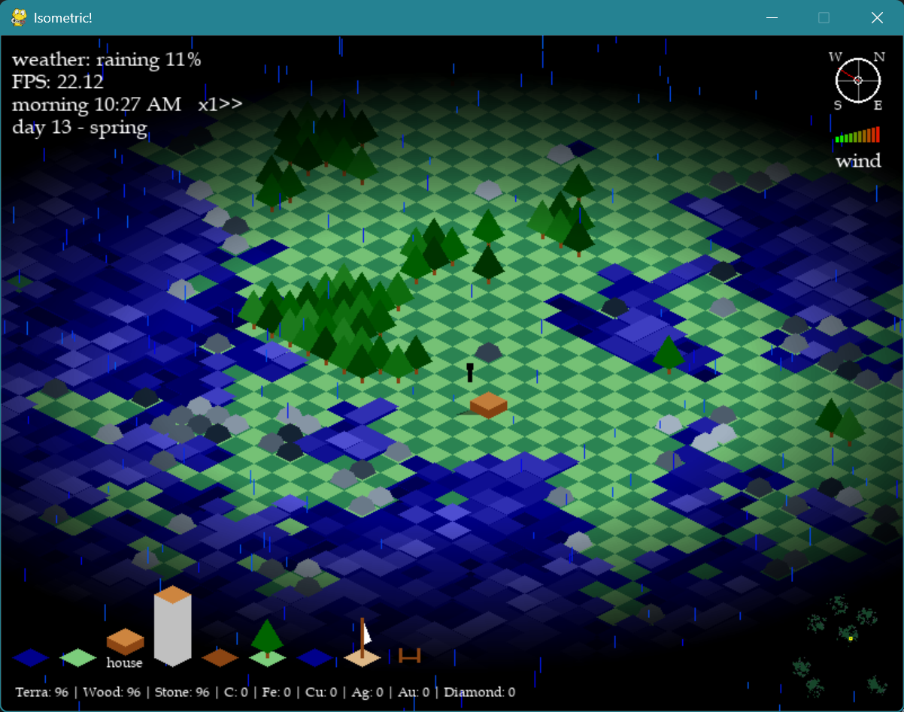
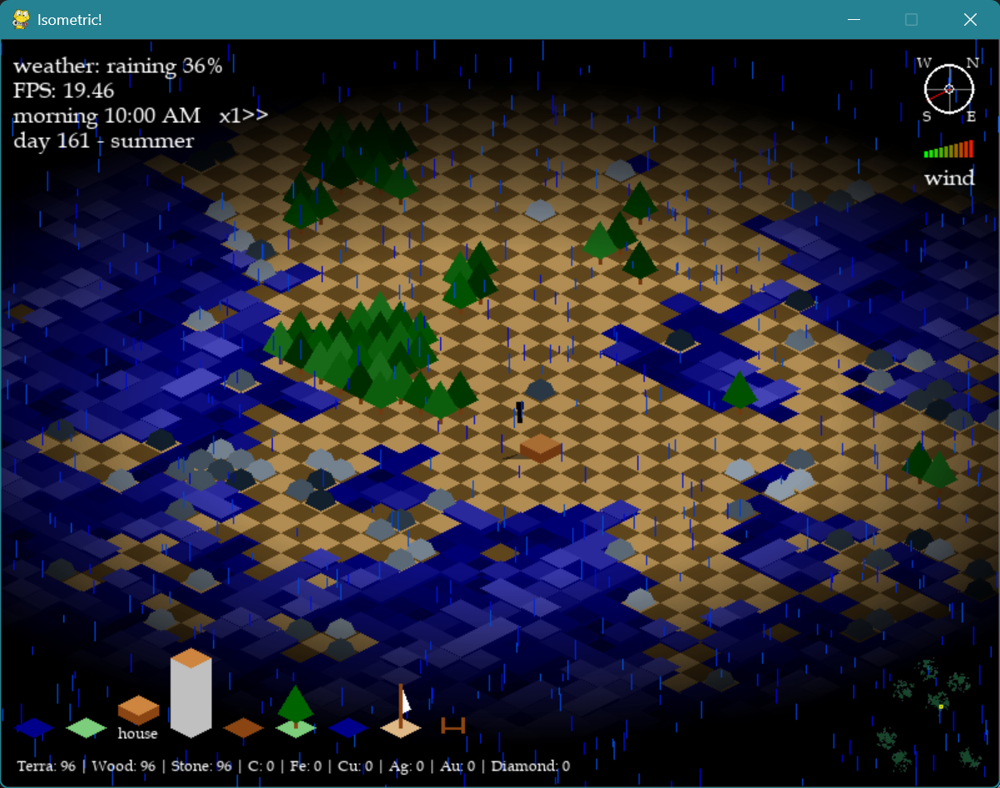

## Instructions

### Build table:
Building stuff will cost you these resources:
```
build_table = {
    +2:     {"wood": -4, "stone": -4, "dirt": -4},          # build house
    +3:     {"wood": -4, "stone": -12, "dirt": -12},        # build tower
    +4:     {"wood": -2},                                   # build bridge
    +7:     {"wood": -4},                                   # build boat
    +13:    {"wood": -12},                                  # build a ladder
```
### Rules
- you can build houses and towers only on ground.
- you can build bridges and boat only on water.
- you can't remove buildings, i honestly don't remember if you can with boats. To re-collect the placed bridges use the water tile. You can use the B-dig item to dig from your back, it's useful to walk forward and dig what you leave behind. Or just use the frontal dig and get crazy by keeping turning back and forth to dig and walk away.
- build ladders to connect upper and underworld.
- if you step into houses or towers time runs faster. Use it to advance trough daycycle and seasons. Increase the speed time by putting collected ores inside a Mistery Cube [?] you can find positioned underground below one of the 7 islands. The rarest the ore the highest the increase in the speed multiplier by the table below:
  ```
  time_value_table = {
          "coal" : 1,
          "iron": 2,
          "copper": 3,
          "silver": 4,
          "gold": 5,
          "diamond": 10
      }
  ```
  The equation to get the speed multiplier is .. weird. It multiplysum all the ores you put in the Cube [?] (example you put 2 silver and 3 coal: tot = 2x4 + 3x1) and then  multiply this by an addictional multiplier ```mult``` based on the achieved ores. (example the first time you put something, ```mult``` goes from 1 to the value of the ore you put, but just once. Let's say you put iron the it goes from 1 to 2. Then you also put silver: ```mult`` goes from what it was (2) to 2x4, where 4 is the value of silver. And up to having all the 6 ores to his maximum value of 2x3x4x5x10.)

## Features
- **season-based nature colors** with smooth color-transision between the seasons
  <p align="center">
    
    
    
  </p>
- **day-night cycles:** during the day (8-20) the sun creates shadows on the buildings, during the night it get darker but buildings diffuse a fading light around them.

  
- **wind mechanics:** the wind power and direction changes accordingly to a brownian motion pattern. When sailing, the boats moves only if the wind direction is in your favor :)

  <p align="center">
    
    
  </p>
- **camera-based map loading:** the full map is 1000x1000 tiles (pretty huge :) The game will intelligently loads and run only the tiles that you can see on the screen. You can look around panning with the [LEFT_MOUSE_BUTTON] and recenter the view pressing [SPACE] or by just moving the player: the view will recenter automatically.

  _NERDY STUFF:_ The ellipse-like viewing angle and the isometric view of the map makes the actual seen-tiles a complex equation between the geometric ellipse and the isometric projection. What matters is to solve the compromise between finding the active tiles, updating and drawing all-of-them, in the shortest computational time possible, making this a compromise between the fastest finding method and the smallest amount of tiles. A simple rectangular window around the player that covers enough screen around the player is the best solution i found: requires basically no computational time since to find the isometric borders of the rectangular window, with the price of drawing some addictional tiles in the corner that can't be seen on the screen due to the isometric geometry + ellipse view.
- **wave pattern:** the sea has waves that moves harmonically from the map borders towards the center of the map. The combination between color changing and height offset creates a pretty wavy effect, which get _naturalized_ by using a constant randomic offset map that is used by waves to constantly offset their vertical position, adding some turbulence in the _too much regular_ sinusoidal motion. The randomic offset map is also used to create some variety betweem the colors of trees and stones, giving a _natural looking_ effect to them.
- **procedurally-generated map** (here i got helped by my dear friend ChatGPT) There are n=7 islands in the archipelago. The same map is re-cycled to optimize the generation time and to match the upper and underworld such that under every island there are big caves you can reach by ladders and explore to mine ores. This generates 4 island levels which got used to spawn trees in the most inner part of the island and stones/rocks towards the sea. Every night 30 new trees spawns. Underground minerals are spawned with another randomic generation procedure that spawns small clusters of size 2x2 or 3x3 with increased rarity from coal to diamond.
- **BFS for underworld view:** under ground it's darker, you have reduced viewing angle, and addictionally, the game run a BFS to shown to you only what's connected to you, creating a discovery mechanism of caves if you're digging a corridor underground.
  <p align="center">
    
    
  </p>
- **look-up table** between current_item and tile object if the player interact with them.
