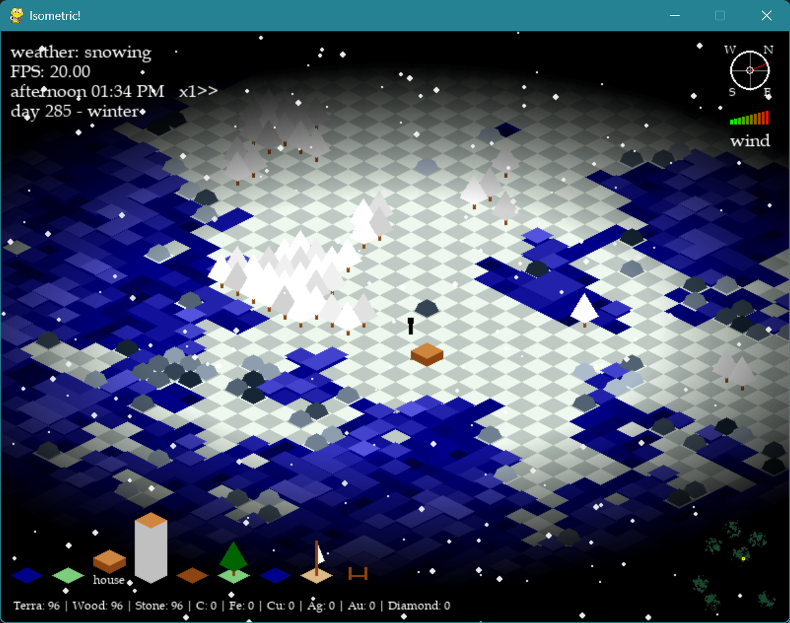

## Instructions

## Features

- \textbf{season-based} nature colors with smooth color-transision between the seasons
  

    
    
    
  

- day-night cycles: During the day (8-20) the sun rise, create shadows on the buildings, and set. During the night it get darker but buildings creates a 
- 

  
  
  

